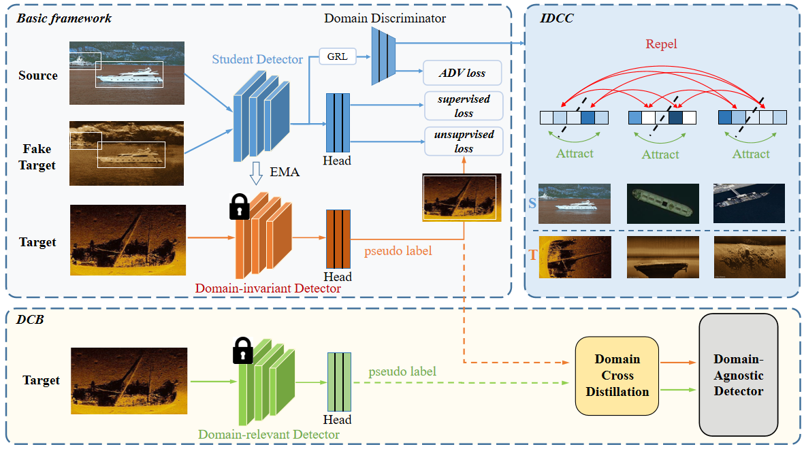

This is the PyTorch implementation of our paper:
**Unsupervised underwater shipwreck detection in side-scan sonar images based on domain-adaptive techniques**




| Methods on Cityscape to Foggy Cityscape | Backbone   | density | mAP(%)     |
| --------------------------------------- | ---------- | ------- | ---------- |
| Source(Faster R-CNN)                    | Resnet-101 | 0.02    | 25.6       |
| Adaptive Teacher(CVPR2022)              | Resnet-101 | 0.02    | 48.1       |
| DCBD(ours)                              | Resnet-101 | 0.02    | 52.6(+4.5) |
| Oracle                                  | Resnet-101 | 0.02    | 43.2       |


| Methods on Optical to SSS Shipwreck     | Backbone   | mAP(%)     |
| --------------------------------------- | ---------- | -------    | 
| Source(Faster R-CNN)                    | Resnet-101 | 21.07      |
| CycleGAN(ICCV2017)                      | Resnet-101 | 50.37      |
| Adaptive Teacher(CVPR2022)              | Resnet-101 | 73.47      |
| Adaptive Teacher + CycleGAN             | Resnet-101 | 89.20      |
| DCBD(ours)                              | Resnet-101 | 92.16      |
| Oracle                                  | Resnet-101 | 94.26      |

make sure you have set your dataset in ``/home/shu3090/wcw/adapteacher/data/datasets/builtin.py``

train:

```
python train.py --config ./configs/faster_rcnn_R101_cross_city_res_change.yaml --num-gpus 2
```

resume:

```
python train.py --config ./configs/faster_rcnn_R101_cross_city_res_change.yaml --resume --num-gpus 2
```

eval-only:

```
python train.py --config ./configs/faster_rcnn_R101_cross_city_res_change.yaml --resume --eval-only
```

test:

```
python train.py --config ./configs/faster_rcnn_R101_cross_city_res_change.yaml --resume --eval-only
```

train DCBD:

```
#the first stage:
#train DID 
python train_net.py --config ./configs/faster_rcnn_R101_cross_city_res_change.yaml --num-gpus 2
#train DRD
#1/Delete GRL module and IDCC module, retrain the detector
python train_net.py --config ./configs/faster_rcnn_R101_cross_city_res_change.yaml --num-gpus 2

#DCB:
#fusing precition from DID and DRD to train DAD, DS and DP means DID and DRD actually
python train_net_cb.py --config ./configs/faster_RCNN_city_cb.yaml --num-gpus 2 MODEL.WEIGHTS_DP="$your weight of DRD.pth$" MODEL.WEIGHTS_DS="$your weight of DID.pth$"
```

if you need a visualization demo for detection, We have implemented a simple demo using Gradio:
```
python visualization_demo.py --config ./configs/faster_rcnn_R101_cross_city_res_change.yaml
```
